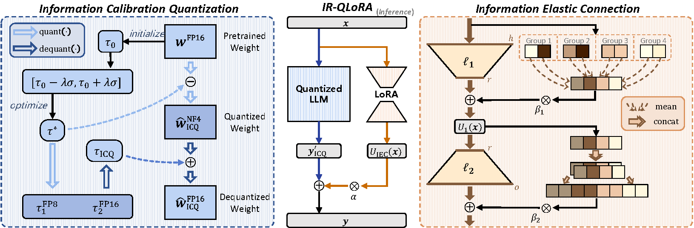

# IR-QLoRA

Created by Haotong Qin, Xudong Ma, Xingyu Zheng, Xiaoyang Li, Yang Zhang, Shouda Liu, Jie Luo, Xianglong Liu and Michele Magno from Beihang University, Bytedance AI Lab, and ETH Zürich.

## Introduction

This project is the official implementation of our [Accurate LoRA-Finetuning Quantization of LLMs via Information Retention]().
The LoRA-finetuning quantization of LLMs has been extensively studied to obtain accurate yet compact LLMs for deployment on resource-constrained hardware. However, existing methods cause the quantized LLM to severely degrade and even fail to benefit from the finetuning of LoRA. This paper proposes a novel **IR-QLoRA** for pushing quantized LLMs with LoRA to be highly accurate through information retention. The proposed IR-QLoRA mainly relies on two technologies derived from the perspective of unified information: (1) statistics-based *Information Calibration Quantization* allows the quantized parameters of LLM to retain original information accurately; (2) finetuning-based *Information Elastic Connection* makes LoRA utilizes elastic representation transformation with diverse information. Comprehensive experiments show that IR-QLoRA can significantly improve accuracy across LLaMA and LLaMA2 families under 2-4 bit-widths, *e.g.*, 4-bit LLaMA-7B achieves 1.4% improvement on MMLU compared with the state-of-the-art methods. The significant performance gain requires only a tiny 0.31% additional time consumption, revealing the satisfactory efficiency of our IR-QLoRA. We highlight that IR-QLoRA enjoys excellent versatility, compatible with various frameworks (*e.g.*, NormalFloat and Integer quantization) and brings general accuracy gains.



## Getting Started

This tutorial uses the Alpaca dataset as an example to perform IR-QLoRA fine-tuning on the LLaMA-7B model in PyTorch.

### Fine-tune
The `irqlora.py` code is a starting point for finetuning and inference on various datasets. Basic command for finetuning a baseline model on the Alpaca dataset:

```bash
python irqlora.py --model_name_or_path <path_or_name>
```

We provide a script in `scripts/finetune.sh` file for fine-tuning on alpaca, and you are free to adjust its parameters to get the results you want.

### Evaluation

To evaluate the fine-tuned model, you can use the `evaluate_mmlu.py` script. Basic command for evaluating a fine-tuned model on the MMLU dataset:

```bash
python evaluate_mmlu.py --model_name_or_path <path_or_name> --lora_ckpt_dir <lora_checkpoint_dir>
```

We provide a script in `scripts/evaluate_mmlu.sh` file for evaluating on mmlu (5-shot).
